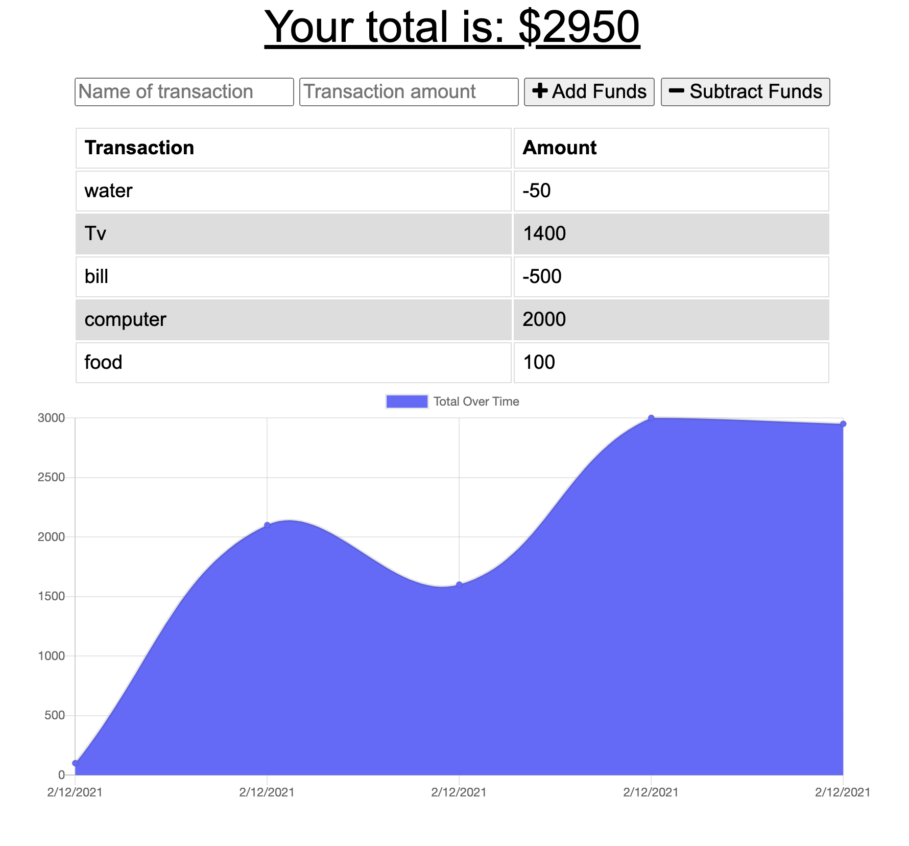
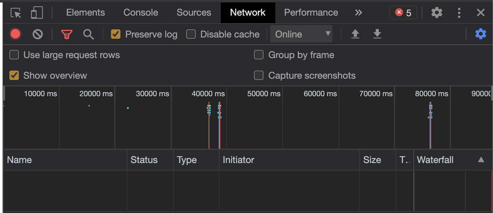
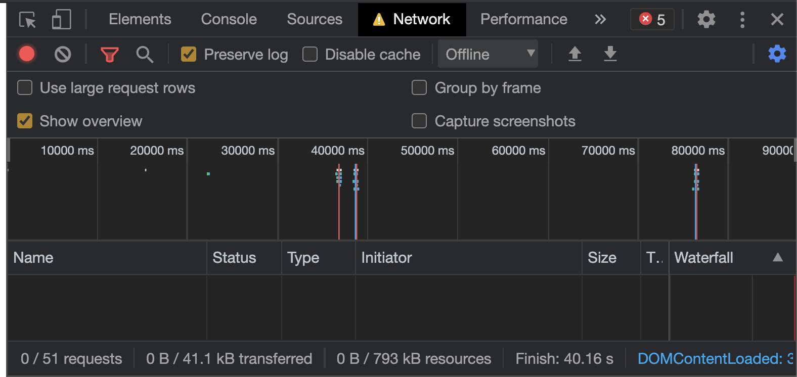

 # Workout Tracker

  ## Description
  ### The user is be able to add expenses and deposits to their budget with or without a connection. When entering transactions offline, It populate the total when brought back online and they will not lose any transaction been done while offline
  ## Table of Contents:
- [Installation](#Installation)
- [Usage](#Usage)
- [Licenses](#Licenses)
- [Contributing](#Contributing)
- [Test](#Test)
- [Questions](#Questions)

## Installation
To install necessary dependencies run the following command:
  npm i
## Test:
  To run tests, run the following command:
  N/A

## Usage:
  
## Licenses
**These are the licenses needed for this project.**  

## Contributing:
  

## Questions:
Contact Me: mikebannoura@gmail.com 
GitHub Username: Bannoura9 
Github profile picture: 

Deployed app link: 
https://budget-tracker-bann.herokuapp.com/

GitHub repo:
https://github.com/bannoura9/Budget-Trackers

  
  

